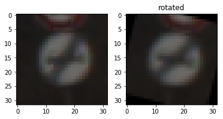
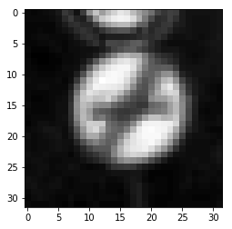
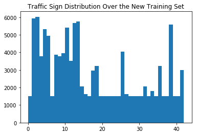
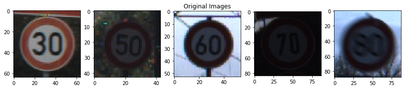

# **Traffic Sign Recognition** 

## Writeup

### You can use this file as a template for your writeup if you want to submit it as a markdown file, but feel free to use some other method and submit a pdf if you prefer.

---

**Build a Traffic Sign Recognition Project**

The goals / steps of this project are the following:
* Load the data set (see below for links to the project data set)
* Explore, summarize and visualize the data set
* Design, train and test a model architecture
* Use the model to make predictions on new images
* Analyze the softmax probabilities of the new images
* Summarize the results with a written report

[//]: # "Image References"

[image1]: ./figs/dist.png "Visualization"
[image2]: ./examples/grayscale.jpg "Grayscaling"
[image3]: ./examples/random_noise.jpg "Random Noise"
[image4]: ./examples/placeholder.png "Traffic Sign 1"
[image5]: ./examples/placeholder.png "Traffic Sign 2"
[image6]: ./examples/placeholder.png "Traffic Sign 3"
[image7]: ./examples/placeholder.png "Traffic Sign 4"
[image8]: ./examples/placeholder.png "Traffic Sign 5"

## Rubric Points
### Here I will consider the [rubric points](https://review.udacity.com/#!/rubrics/481/view) individually and describe how I addressed each point in my implementation.  

---
### Writeup / README

#### 1. Provide a Writeup / README that includes all the rubric points and how you addressed each one. You can submit your writeup as markdown or pdf. You can use this template as a guide for writing the report. The submission includes the project code.

You're reading it! and here is a link to my [project code](https://github.com/majid-khonji/CarND-Traffic-Sign-P2/blob/master/Traffic_Sign_Classifier.ipynb)

### Data Set Summary & Exploration

#### 1. Provide a basic summary of the data set. In the code, the analysis should be done using python, numpy and/or pandas methods rather than hardcoding results manually.

I used the standard python `len()` function and `numpy.unique()` to calculate summary statistics of the traffic signs data set:

* The size of training set is 34799
* The size of the validation set is 12630
* The size of test set is 4410
* The shape of a traffic sign image is (32,32,3)
* The number of unique classes/labels in the data set is 43

#### 2. Include an exploratory visualization of the dataset.

Here is an exploratory visualization of the data set. The bar bar chart below shows the data frequency over traffic signs.

![alt text][image1]

A sample image is shown below together with a rotation operation by $-15^\circ$.

### Design and Test a Model Architecture

#### 1. Describe how you preprocessed the image data. What techniques were chosen and why did you choose these techniques? Consider including images showing the output of each preprocessing technique. Pre-processing refers to techniques such as converting to grayscale, normalization, etc. (OPTIONAL: As described in the "Stand Out Suggestions" part of the rubric, if you generated additional data for training, describe why you decided to generate additional data, how you generated the data, and provide example images of the additional data. Then describe the characteristics of the augmented training set like number of images in the set, number of images for each class, etc.)

As a first step, I decided to convert the images to grayscale because comparing to the above sample image, the grayscale shows more contrast (at least for human eyes)

Here is an example of a traffic sign image after grayscaling.

As a last step, I normalized the image data because I want the data to have zero mean and equal variance to avoid numerical issues for the optimizer and help the optimizer to converge faster.

I decided to generate additional data because of two reasons:

* First,  there are few data points for certain traffic signs (see the above distribution). This could cause the classifier to overfit data towards other traffic signs.
* Second, to capture intrinsic features of the signs which are typically are invariant to shifting and rotation (with a small angle).

To add more data to the the data set, I used the following techniques:

* For classes with less than 500 data points, I generated fake data until they become 500 data points. These fake data are either (with equal probability):
  * Rotated by an angle $\in [-20, 20]$ degrees, or
  * Translated by $x,y \in [-5,5]$
* In addition, I created two copies of the whole training set, one translated and one rotated in the same fashion as above.

The new distribution of the training set over the traffic signs is shown below:

I tried to generate fake data until each class contains 2500 data points, but this yielded bad accuracy.

#### 2. Describe what your final model architecture looks like including model type, layers, layer sizes, connectivity, etc.) Consider including a diagram and/or table describing the final model.

My final model consisted of the following layers:

|                  Layer                   |               Description                |
| :--------------------------------------: | :--------------------------------------: |
|                  Input                   |         32x32x1 Grayscale image          |
|             Convolution 5x5              | 1x1 stride, VAlID padding, outputs 28x28x6 |
|                   ELU                    | Based on TensorFlow documentation, I used `tf.nn.elu` function which gave me better results than `relu` |
|               Max pooling                |       2x2 stride,  outputs 14x14x6       |
|             Convolution 5x5              | 1x1 stride, VAlID padding, outputs 10x10x16 |
|                   ELU                    |           `tf.nn.elu` function           |
|               Max pooling                |       2x2 stride,  outputs 5x5x16        |
|               Fully Con.1                | Fully connected layer: Input = 400, Output = 120 |
|                   RELU                   |                                          |
|               Fully Con. 2               |         Input = 120, Output = 84         |
|                   RELU                   |                                          |
| Skip layers and Concatenate with the last | A copy of the the first ELU output is flattened (outputs 1176 features) and concatenated with the last RELU, with output size of 1260. |
|               Fully Con. 3               |      Input 1260. Output 43 classes.      |

#### 3. Describe how you trained your model. The discussion can include the type of optimizer, the batch size, number of epochs and any hyperparameters such as learning rate.

To train the model, I used a batch size of 128, 100 epochs, and a learning rate of 0.001. The optimizer used is AdamOptimizer with softmax cross entropy objective function.

#### 4. Describe the approach taken for finding a solution and getting the validation set accuracy to be at least 0.93. Include in the discussion the results on the training, validation and test sets and where in the code these were calculated. Your approach may have been an iterative process, in which case, outline the steps you took to get to the final solution and why you chose those steps. Perhaps your solution involved an already well known implementation or architecture. In this case, discuss why you think the architecture is suitable for the current problem.

My final model results were:
* training set accuracy of 0.993
* validation set accuracy of 0.93
* test set accuracy of 0.939

If an iterative approach was chosen:
* What was the first architecture that was tried and why was it chosen?
  * I initially considered LeNet-5 since it provided promising results with grayscale hand-writing images.
* What were some problems with the initial architecture?
  * Poor performance (~89% for validation accuracy)
* How was the architecture adjusted and why was it adjusted? Typical adjustments could include choosing a different model architecture, adding or taking away layers (pooling, dropout, convolution, etc), using an activation function or changing the activation function. One common justification for adjusting an architecture would be due to overfitting or underfitting. A high accuracy on the training set but low accuracy on the validation set indicates over fitting; a low accuracy on both sets indicates under fitting.
  * The LeNeT-5 model suffers from over-fitting with traffic sign data (observed by high training accuracy and lower validation accuracy). My final model is based on LeNet-5 but with two distinctions:
    - The use of ELU activation function, based on a recent paper [Clevert 2015]. Empirically, ELU showed less overfitting than RELU
    - Motivated by the research paper [Sermanet 2011], I created a connection from the first convolution output to the last layer, which skips subsequent layers.
* Which parameters were tuned? How were they adjusted and why?
  * I adjusted number of epochs as I noticed  validation accuracy was increasing.
* What are some of the important design choices and why were they chosen? For example, why might a convolution layer work well with this problem? How might a dropout layer help with creating a successful model?
  * The most design feature involved the skip layer idea from  [Sermanet 2011] in order to give the classifier (the last layer) different levels of abstractions of the data. As the author explains: "The motivation for combining representation from multiple stages in the classifier is to provide different scales of receptive fields to the classifier. In the case of 2 stages of features, the second stage extracts “global” and invariant shapes and structures, while the first stage extracts “local” motifs with more precise details."

If a well known architecture was chosen:
* What architecture was chosen?
* Why did you believe it would be relevant to the traffic sign application?
* How does the final model's accuracy on the training, validation and test set provide evidence that the model is working well?

### Test a Model on New Images

#### 1. Choose five German traffic signs found on the web and provide them in the report. For each image, discuss what quality or qualities might be difficult to classify.

Here are five German traffic signs that I found on the web:

The images are chosen to test the classifier against different backgrounds and lighting conditions for speed signs. The first image is chosen as an example of a bright and vivid image for benchmarking and comparing against other images. The second one is dark and has a dark background. The third is similar to the second but with a light background. The fourth is taken at night under very poor lighting condition. The last is blurred, which is different from other images.

#### 2. Discuss the model's predictions on these new traffic signs and compare the results to predicting on the test set. At a minimum, discuss what the predictions were, the accuracy on these new predictions, and compare the accuracy to the accuracy on the test set (OPTIONAL: Discuss the results in more detail as described in the "Stand Out Suggestions" part of the rubric).

Here are the results of the prediction:

|        Image         |      Prediction      |
| :------------------: | :------------------: |
| Speed limit (30km/h) | Speed limit (30km/h) |
| Speed limit (50km/h) | Speed limit (50km/h) |
| Speed limit (60km/h) | Speed limit (60km/h) |
| Speed limit (70km/h) | Speed limit (70km/h) |
| Speed limit (80km/h) | Speed limit (80km/h) |

The model was able to correctly guess 5 of the 5 traffic signs, which gives an accuracy of 100%. This compares favorably to the accuracy on the test set which is 94%. 

#### 3. Describe how certain the model is when predicting on each of the five new images by looking at the softmax probabilities for each prediction. Provide the top 5 softmax probabilities for each image along with the sign type of each probability. (OPTIONAL: as described in the "Stand Out Suggestions" part of the rubric, visualizations can also be provided such as bar charts)

The code for making predictions on my final model is located in the 37th cell of the Ipython notebook.

For the first image, the model is sure that this is a speed limit 30km/h sign (probability of almost 1), and the image does contain a speed limit 30km/h. The top five soft max probabilities were

|  Probability   |      Prediction       |
| :------------: | :-------------------: |
| 1.00000000e+00 | Speed limit (30km/h)  |
| 7.95384000e-21 | Speed limit (80km/h)  |
| 1.48061426e-28 | Speed limit (50km/h)  |
| 6.41022108e-32 | Speed limit (100km/h) |
| 7.76713862e-34 | Speed limit (120km/h) |

The second images shows a similar pattern than the above.

### (Optional) Visualizing the Neural Network (See Step 4 of the Ipython notebook for more details)
#### 1. Discuss the visual output of your trained network's feature maps. What characteristics did the neural network use to make classifications?

